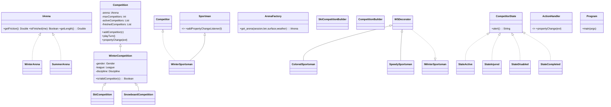

### Winter Sports Competition Simulator

A Java OOP + multithreading Swing GUI app that simulates winter sports (ski/snowboard) competitions with live arena visualization, league rules, cloning, and decorators.

### Screenshots/GIFs

- GUI main panel: `docs/screenshot-main.png`
- Arena view with competitors: `docs/screenshot-arena.png`
- Results dialog: `docs/screenshot-results.png`
- Animated race (GIF): `docs/demo.gif`

### Features

- **Arena builder**: Choose session (Winter), length (700–900), snow surface, and weather.
- **Competition setup**: Select competition type (Ski/Snowboard), discipline, league, and gender.
- **Competitor management**: Add competitors (name, age, maxSpeed, acceleration); copy existing via Prototype/Clone.
- **Decorator customization**: Apply speed and color decorators without changing base classes.
- **Live GUI**: Real-time progress on an arena board with per-competitor icons and a scoreboard.
- **Concurrency**: Each competitor runs on its own thread; synchronized finish handling ensures consistent results.
- **Validation**: League and gender rules enforced; input validation for ranges.
- **Restart**: Reset and rebuild competitions quickly.

### Architecture Overview



Short notes:

- GUI with Swing in `src/Gui` (`BPanel`, `ActionHandler`).
- Core domain under `src/game/*` with clear interfaces and enums.
- Observer: `PropertyChangeSupport` in `game.entities.sportsman.Sportman`; observers include `game.competition.Competition` and `Gui.ActionHandler`.
- Threads: each competitor is a `Runnable` with its own thread.

### Design Patterns

- **Factory**: `game.arena.ArenaFactory` builds `IArena` instances from session/surface/weather.
- **Builder**: `game.competition.SkiCompetitionBuilder` constructs a default competition with validated parameters and bulk competitors.
- **Prototype/Cloneable**: `Skier.clone()` / `Snowboarder.clone()` duplicate competitors quickly.
- **Decorator**: `WSDecorator`, `SpeedySportsman`, `ColoredSportsman` add speed/color without modifying base classes.
- **State**: `CompetitorState` with `StateActive`, `StateInjured`, `StateDisabled`, `StateCompleted` driving lifecycle and UI labels.
- **Observer**: `PropertyChangeListener` chain updates Competition and GUI on `location`/`finished` events.

### Concurrency & Thread-Safety

- **Threads**: One thread per competitor (`Sportman.run` loop with `Thread.sleep(70)`).
- **Shared model**: `Competition` maintains `activeCompetitors` and `finishedCompetitors`.
- **Synchronization**: Finish transitions guarded in `Competition.finished_Race` using `synchronized` on lists.
- **UI threading**: Property events originate off-EDT; when extending, wrap Swing updates with `SwingUtilities.invokeLater`.
- **Primitives used**: `synchronized`, `java.beans.PropertyChangeSupport/Listener`.

### GUI

- **Framework**: Swing (`JFrame`, `JPanel`, `JLayeredPane`, `JTable`, `JOptionPane`).
- **Screens**: Right-side control panel (Build Arena → Create Competition → Add/Copy/Customize → Start/Show Info). Center arena board with weather background and layered competitor icons.
- **Rendering**: Observes competitor `location` changes to move `JLabel`s; scoreboard built with an uneditable `JTable`.

### Getting Started

- **Prereqs**: JDK 17; Windows/macOS/Linux.
- **Entry Point**: `utilities.Program#main`.

Compile and run (no build tool required):

Windows (PowerShell):

```powershell
mkdir out -Force
Get-ChildItem -Recurse -Filter *.java | Select-Object -ExpandProperty FullName | Set-Content sources.txt
javac -d out @sources.txt
java -cp out utilities.Program
```

macOS/Linux or Git Bash:

```bash
javac -d out $(git ls-files "*.java")
java -cp out utilities.Program
```

If you prefer Maven (add a `pom.xml` first):

```bash
mvn -q clean package
mvn -q exec:java -Dexec.mainClass=utilities.Program
```

If you prefer Gradle (add `build.gradle` with application plugin):

```bash
gradlew run
```

### Configuration

- **Arena types**: `Winter` (UI restricts competitors to Winter), `Summer` available in code.
- **Snow surface**: `POWDER`, `CRUD`, `ICE`
- **Weather**: `SUNNY`, `CLOUDY`, `STORMY`
- **Leagues (age rules)**:
  - `JUNIOR` [12–16), `ADULT` [17–30), `SENIOR` [30+)
- **Disciplines**: `SLALOM`, `GIANT_SLALOM`, `DOWNHILL`, `FREESTYLE`

Sample enum usage:

```java
League.JUNIOR.isInLeague(age);
Discipline.SLALOM;
WeatherCondition.SUNNY;
```

### Usage Walkthrough

1. Build Arena: pick length 700–900, surface, weather.
2. Create Competition: Ski/Snowboard, set max competitors, discipline, league, gender.
3. Add Competitor: set name, age, max speed, acceleration.
4. Clone Competitor: choose an existing competitor and click “Copy competitor”.
5. Customize: click “Costume Competitor” to apply speed and color decorators.
6. Start Race: click “Start Competition”. Use “Show Info” to list standings and states.

### Extending the Project

- **Add a new arena type**: implement `game.arena.IArena` and register in `ArenaFactory.get_arena`.
- **Add a decorator**: extend `game.competition.WSDecorator` (e.g., energy, penalties) and override behavior.
- **Add a league rule**: evolve `game.enumm.League` or add checks to `WinterCompetition.isValidCompetitor`.
- **Hook a new observer**: subscribe a `PropertyChangeListener` (e.g., CSV logger) to each competitor.

### Code Examples

Create an arena via Factory:

```java
import game.arena.ArenaFactory;
import game.arena.IArena;
import game.enumm.SnowSurface;
import game.enumm.WeatherCondition;
IArena arena = new ArenaFactory().get_arena("Winter", 800, SnowSurface.ICE, WeatherCondition.CLOUDY);
```

Build a competition via Builder:

```java
import game.competition.SkiCompetitionBuilder;
var builder = new SkiCompetitionBuilder(10);
builder.BuildWinterArena();
builder.BuildLeague();
builder.BuildGender();
builder.BuildDiscipline();
builder.BuildMaxCompetitors();
builder.BuildCompetitorsArry();
var competition = builder.getSkicopm();
```

Clone a competitor (Prototype):

```java
import game.entities.sportsman.Skier;
Skier original = /* from competition */;
Skier copy = original.clone();
```

Subscribe an Observer to updates:

```java
competitor.addPropertyChangeListener(evt -> {
  if ("location".equals(evt.getPropertyName())) {
    // For UI updates, prefer SwingUtilities.invokeLater(...)
  }
});
```

Simple State transition:

```java
import game.states.StateCompleted;
competitor.setCurrentState(new StateCompleted()); // competitor.alert() -> "Completed"
```

### Testing

- No tests included yet.
- For deterministic runs, seed the `Random` used in `game.competition.Competition.destiny()`.
- Recommended: add JUnit 5 for league validation, state transitions, builder/decorator behavior.

### Performance Notes

- N competitor threads (`Runnable` loop with 70ms tick).
- `synchronized` protects moves from active→finished.
- GUI repaint cost grows with competitors; consider batching updates and using `SwingUtilities.invokeLater`.

### Known Limitations

- Hardcoded absolute asset paths in `Gui.ActionHandler` (Windows-specific). Replace with classpath resources under `src/Gui/icons`.
- No pause/resume; only restart.
- Some Swing updates are performed off-EDT.
- No Maven/Gradle files included by default.

### Roadmap

- Replace hardcoded image paths with classpath resources.
- Add pause/resume controls and safer restart.
- Introduce Maven/Gradle and JUnit 5 tests.
- Seed RNG for reproducible races; configurable tick rate.
- Ensure all Swing updates are on the EDT.

### License

MIT. See `LICENSE`.

### Acknowledgments

Inspired by an educational OOP assignment. Thanks to the Java community for patterns and practices used.
